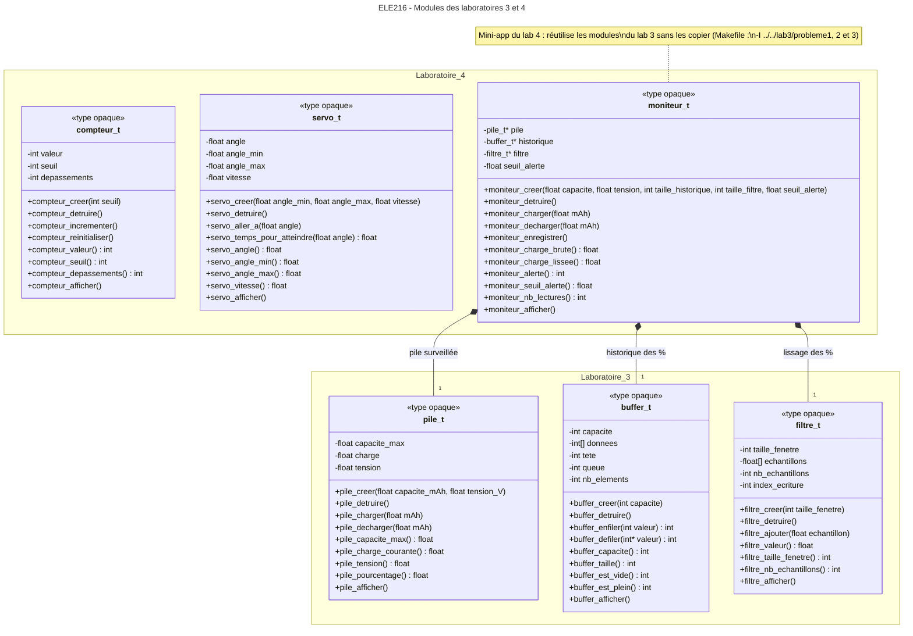

# Modules des laboratoires 3 et 4

## Légende

- `+` : fonction publique, déclarée dans le `.h` ; c'est tout ce que l'utilisateur
  du module voit.
- `-` : champ privé de la `struct`, caché dans le `.c` (type opaque) ; on n'y
  accède que par les fonctions publiques.
- Toutes les fonctions, sauf `*_creer`, reçoivent le pointeur vers le type
  opaque en premier paramètre (omis sur la figure pour l'alléger).
- `*_creer` retourne un pointeur vers une nouvelle instance allouée sur le heap,
  ou `NULL` si un paramètre est invalide ; `*_detruire` la libère
  (`*_detruire(NULL)` ne fait rien).
- Losange plein (composition) : le moniteur crée sa pile, son buffer et son
  filtre dans `moniteur_creer` et les détruit dans `moniteur_detruire`.
