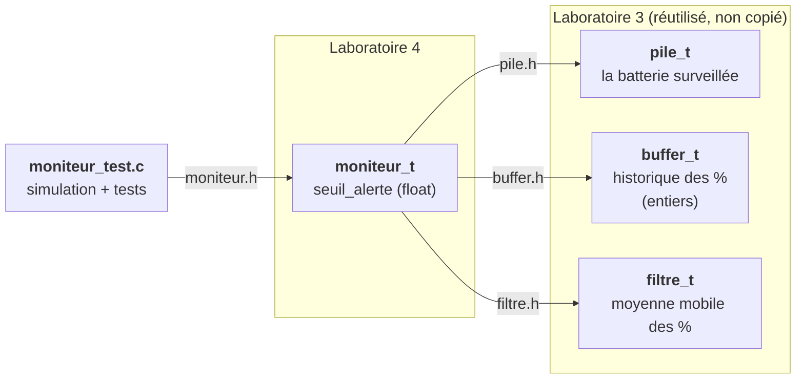
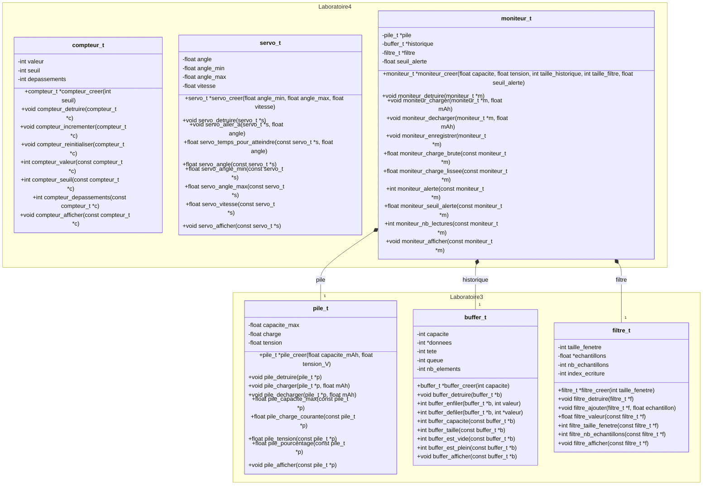
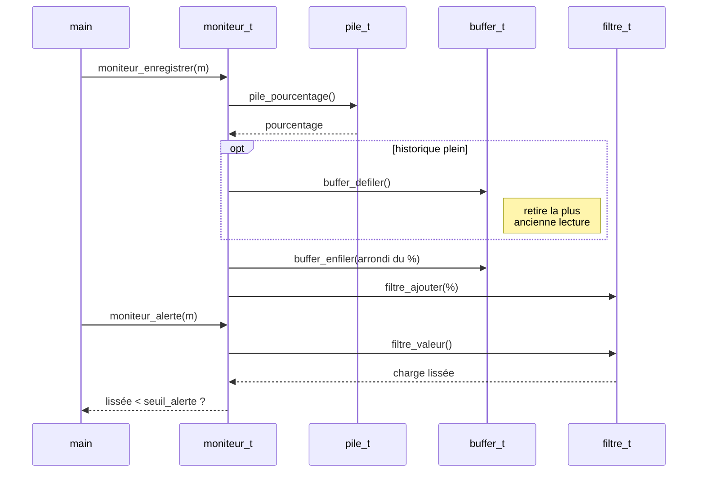

# Mini-app du laboratoire 4 : moniteur de batterie

Le moniteur est un module du laboratoire 4 construit à partir de trois
modules du laboratoire 3. Il ne connaît d'eux que leur `.h` : il ne touche
jamais à leurs champs.

## 1. Qui contient quoi

Chaque flèche signifie « utilise uniquement les fonctions déclarées dans ce
`.h` ». `moniteur_creer` crée les trois sous-modules et `moniteur_detruire`
les libère.

## 2. Toutes les fonctions des laboratoires 3 et 4

Les champs (`-`) sont privés : ils sont définis dans le `.c` et invisibles
pour les autres modules. Les fonctions (`+`) sont publiques : ce sont
exactement celles déclarées dans le `.h`. Le losange plein indique que
`moniteur_t` possède ses trois sous-modules (il les crée et les détruit).
`compteur_t` (problème 1) et `servo_t` (problème 2) sont indépendants.

## 3. Ce qui se passe lors d'une lecture

`moniteur_charger` et `moniteur_decharger` ne font que relayer vers
`pile_charger` / `pile_decharger` : l'historique et le filtre ne changent
qu'au prochain `moniteur_enregistrer`.
