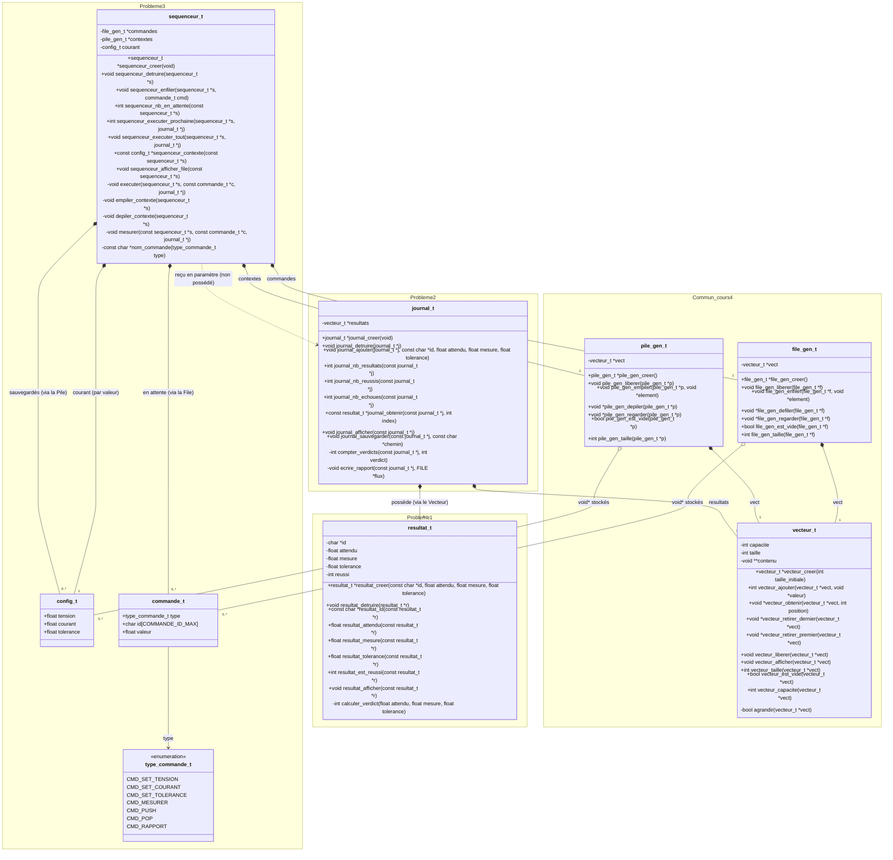

# Problème 3 du laboratoire 5 : séquenceur de commandes

Le séquenceur est construit à partir de la File et de la Pile génériques du
cours 4 (elles-mêmes bâties sur le Vecteur générique) et du journal du
problème 2. Il ne connaît de ces modules que leur `.h` : il ne touche jamais
à leurs champs.

## 1. Diagramme de classes

Lecture du diagramme :

- **Visibilité.** Les champs `-` sont privés : ils sont définis dans le `.c`
  (type opaque) et invisibles pour les autres modules. Les fonctions `-` sont
  les fonctions `static` du `.c`. Les fonctions `+` sont exactement celles du
  `.h`. `config_t` et `commande_t` ne sont **pas** opaques : leurs champs sont
  publics (`+`), car l'appelant doit pouvoir construire une commande et lire
  le contexte.
- **Losange plein (composition).** `sequenceur_t` crée et détruit sa File, sa
  Pile, son contexte courant, ainsi que toutes les copies `commande_t` et
  `config_t` qu'il alloue. Le journal fait de même pour ses `resultat_t`.
- **Losange vide (agrégation).** La File et la Pile ne font que **stocker des
  `void *`**. Elles ne libèrent jamais leurs éléments (`vecteur_liberer` ne
  libère que le tableau de pointeurs). C'est pourquoi `sequenceur_detruire`
  doit les vider lui-même.
- **Pointillé (dépendance).** Le séquenceur utilise un `journal_t` reçu en
  paramètre d'exécution, mais il n'en est pas propriétaire : c'est
  l'appelant qui le crée et le détruit.
- Il y a **deux** `config_t` distincts : `courant`, stocké par valeur dans la
  structure, et les copies sauvegardées par `CMD_PUSH` dans la Pile. La Pile
  est vide à la création.

## 2. Diagramme de séquence : cycle de vie complet

Le scénario suit la démonstration du `main` de `sequenceur_test.c` :
création, enfilage, affichage de la file, exécution de toutes les commandes
(chaque type de commande est détaillé dans un bloc `alt`), lecture du
contexte, puis destruction. Le Vecteur interne de la File, de la Pile et du
journal n'est pas montré.

```mermaid
---
config:
  sequence:
    actorFontSize: 18
    messageFontSize: 16
    noteFontSize: 15
    messageMargin: 30
---
sequenceDiagram
    participant T as main (sequenceur_test.c)
    participant S as sequenceur_t
    participant F as file_gen_t
    participant P as pile_gen_t
    participant J as journal_t
    participant R as resultat_t
    participant C as stdlib (malloc, free, rand)

%% ---------- Création ----------
    T->>S: sequenceur_creer()
    S->>C: malloc(sizeof(sequenceur_t))
    S->>F: file_gen_creer()
    F-->>S: commandes
    S->>P: pile_gen_creer()
    P-->>S: contextes (pile vide)
    alt File ou Pile NULL
        S->>F: file_gen_liberer() si créée
        S->>P: pile_gen_liberer() si créée
        S->>C: free(s)
        S-->>T: NULL
    else succès
        Note over S: courant = { 0 V, 0 A, 5 % }
        S-->>T: s
    end
    T->>J: journal_creer()
    J-->>T: j
    T->>C: srand(SEED)

%% ---------- Enfilage ----------
    loop pour chaque commande du scénario
        T->>S: sequenceur_enfiler(s, cmd) (copie par valeur)
        S->>C: malloc(sizeof(commande_t))
        C-->>S: copie
        Note over S: *copie = cmd<br/>id[COMMANDE_ID_MAX - 1] = terminateur nul
        S->>F: file_gen_taille()
        F-->>S: avant
        S->>F: file_gen_enfiler(copie)
        S->>F: file_gen_taille()
        opt taille inchangée (realloc échoué)
            S->>C: free(copie)
        end
    end

%% ---------- Affichage ----------
    T->>S: sequenceur_afficher_file(s)
    S->>F: file_gen_taille()
    F-->>S: n
    loop n fois (rotation complète)
        S->>F: file_gen_defiler()
        F-->>S: c
        Note over S: printf(nom_commande(c->type), id, valeur)
        S->>F: file_gen_enfiler(c)
    end
    Note over F: même contenu, même ordre

%% ---------- Exécution ----------
    T->>S: sequenceur_executer_tout(s, j)
    loop tant que sequenceur_executer_prochaine(s, j) retourne 1
        S->>F: file_gen_est_vide()
        alt file vide
            F-->>S: true
            Note over S: retourne 0 (fin de la boucle)
        else file non vide
            F-->>S: false
            S->>F: file_gen_defiler()
            F-->>S: c
            S->>S: executer(s, c, j)
            alt CMD_SET_TENSION, CMD_SET_COURANT, CMD_SET_TOLERANCE
                Note over S: courant.champ = c->valeur
            else CMD_PUSH
                S->>C: malloc(sizeof(config_t))
                C-->>S: copie
                Note over S: *copie = courant
                S->>P: pile_gen_taille()
                S->>P: pile_gen_empiler(copie)
                S->>P: pile_gen_taille()
                opt taille inchangée (realloc échoué)
                    S->>C: free(copie)
                end
            else CMD_POP
                S->>P: pile_gen_est_vide()
                alt pile vide
                    P-->>S: true
                    Note over S: stderr : CMD_POP ignorée<br/>courant inchangé
                else pile non vide
                    P-->>S: false
                    S->>P: pile_gen_depiler()
                    P-->>S: sauvegarde
                    Note over S: courant = *sauvegarde
                    S->>C: free(sauvegarde)
                end
            else CMD_MESURER
                alt j == NULL
                    Note over S: stderr : CMD_MESURER ignorée
                else journal présent
                    S->>C: rand()
                    C-->>S: r
                    Note over S: bruit = (2 r / RAND_MAX - 1) x 0.10<br/>mesure = valeur x (1 + bruit)
                    S->>J: journal_ajouter(j, c->id, c->valeur, mesure, courant.tolerance)
                    J->>R: resultat_creer(id, attendu, mesure, tolerance)
                    Note over R: copie de id<br/>verdict PASS ou FAIL calculé
                    R-->>J: r
                    Note over J: vecteur_ajouter(resultats, r)
                end
            else CMD_RAPPORT
                alt j == NULL
                    Note over S: stderr : CMD_RAPPORT ignorée
                else journal présent
                    S->>J: journal_afficher(j)
                    loop chaque résultat
                        J->>R: resultat_id(), attendu, mesure, tolerance, est_reussi
                        R-->>J: valeurs
                    end
                    Note over J: tableau + Total, Reussis, Echoues
                end
            else type inconnu
                Note over S: stderr : commande ignorée
            end
            S->>C: free(c)
            Note over S: retourne 1
        end
    end
    S-->>T: file vide

%% ---------- Lecture du contexte ----------
    T->>S: sequenceur_contexte(s)
    S-->>T: const config_t * vers courant

%% ---------- Destruction ----------
    T->>S: sequenceur_detruire(s)
    loop tant que la File n'est pas vide
        S->>F: file_gen_defiler()
        F-->>S: commande restante
        S->>C: free(commande)
    end
    loop tant que la Pile n'est pas vide
        S->>P: pile_gen_depiler()
        P-->>S: contexte sauvegardé
        S->>C: free(contexte)
    end
    S->>F: file_gen_liberer()
    S->>P: pile_gen_liberer()
    S->>C: free(s)
    T->>J: journal_detruire(j)
    loop chaque résultat
        J->>R: resultat_detruire(r)
    end
```

Points à remarquer :

- **Copies sur le tas.** `sequenceur_enfiler` et `CMD_PUSH` font chacun un
  `malloc` : la File et la Pile ne stockent que des adresses. Stocker
  l'adresse du paramètre `cmd` ou de `courant` serait une erreur.
- **Garde avant chaque retrait.** `file_gen_est_vide` et `pile_gen_est_vide`
  sont toujours appelées avant `defiler` et `depiler`, car le code du cours
  n'a pas d'assert (la taille deviendrait -1).
- **Un seul `free` par élément.** Chaque commande est libérée soit après son
  exécution, soit dans `sequenceur_detruire` si elle est encore en attente.
  Chaque contexte sauvegardé est libéré soit par `CMD_POP`, soit dans
  `sequenceur_detruire`.
- **Rotation en lecture seule.** `sequenceur_afficher_file` modifie
  temporairement la File, mais après `n` rotations elle est identique. Le
  `const` du paramètre ne protège que le pointeur `s->commandes`, pas la
  File pointée.
- **Journal externe.** Le séquenceur appelle le journal mais ne le crée ni
  ne le détruit.
